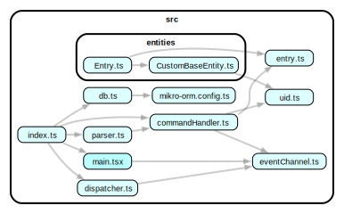

# 🧰 EXEC: project-oriented task and attention management

## philosophy

- Maximise expressive power and flexibility, by
  choosing and combining simple parts.
- Performance is a feature. Be fast.
- Programming is a war against complexity. Cheat, by
  intentionally creating and taming emergent complexity.
- Design for expert users.
- Discoverability cultivates expertise.
- Provide safety, by using nondestructive, event-oriented 
  data.
- Both hierarchies + taxonomies are necessary. Both should 
  be first class concerns, with first class implementations.
- The time dimension is critical.
- Often, the reason we write something down is so that 
  we are free to forget about it.
- Prefer extensibility over tweakability.
- Aggressively separate concerns. 
- Use SQL (SQLite) for speed, and to keep application logic 
  simple.
- Support plain text for sync, backup and interoperability.
- Play well with Markdown notes. Complement Obsidian and 
  Google Calendar.
      
# TODO

- [/] crud operations for simple entries
- [ ] simple tags
- [ ] tag groups
- [ ] statuses
- [ ] confirmation for bulk edits
- [ ] closure table entry hierarchies (triggers)
- [ ] interactive TUI
- [ ] interactive contexts
- [ ] subcommands

command -> interactive? -> confirmation(command)

## Diagrams

